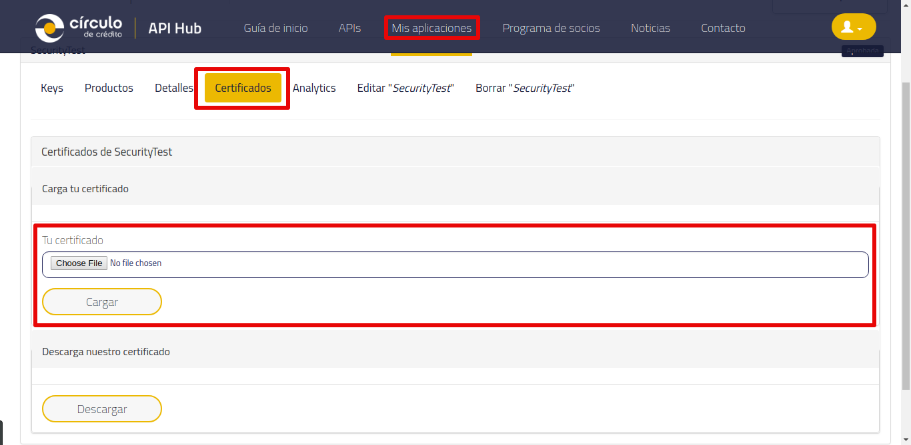
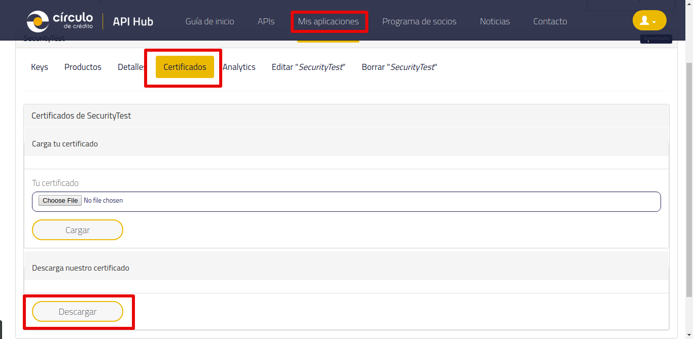

# VANT/AGE-client-php

## Requisitos

PHP 7.1 ó superior

### Dependencias adicionales
- Aegúrese de contar con las siguientes dependencias de PHP:
    - php7.x-curl
    - php7.x-mbstring
- En caso de no ser así, para linux use los siguientes comandos
```sh
apt-get install php7.3-curl
apt-get install php7.3-mbstring
```
- Composer [vea como instalar][1]

## Instalación

Ejecutar: `composer install`

## Antes de correr la prueba
 
### Generar llave y certificado

- Asegúrese de tener su contenedor en formato PKCS12.
- Si no tiene uno, puede ejecutar las instrucciones en **lib/Interceptor/key_pair_gen.sh** ó con los siguientes comandos.
- **opcional**: Si desea cifrar su contenedor, coloque una contraseña en una variable de ambiente.
```sh
export KEY_PASSWORD=your_password
```
- Definición de los nombres de archivos y alias.
```sh
export PRIVATE_KEY_FILE=pri_key.pem
export CERTIFICATE_FILE=certificate.pem
export SUBJECT=/C=MX/ST=MX/L=MX/O=CDC/CN=CDC
export PKCS12_FILE=keypair.p12
export ALIAS=circulo_de_credito
```
- Generar llave y certificado.
```sh
#Genera la llave privada.
openssl ecparam -name secp384r1 -genkey -out ${PRIVATE_KEY_FILE}

#Genera el certificado público.
openssl req -new -x509 -days 365 \
    -key ${PRIVATE_KEY_FILE} \
    -out ${CERTIFICATE_FILE} \
    -subj "${SUBJECT}"
```
- Generar contenedor en formato PKCS12.
```sh
# Genera el archivo pkcs12 a partir de la llave privada y el certificado.
# Deberá empaquetar su llave privada y el certificado.
openssl pkcs12 -name ${ALIAS} \
    -export -out ${PKCS12_FILE} \
    -inkey ${PRIVATE_KEY_FILE} \
    -in ${CERTIFICATE_FILE} -password pass:${KEY_PASSWORD}
```

### Para cargar el certificado (dentro del portal de desarrolladores)
 
 1. Haga clic en la sección "**Mis aplicaciones**", y seleccione su aplicación.
 2. Vaya a la pestaña de "**Certificados**".
 3. Posteriormente deberá hacer clic en el botón debajo del texto "**Tu certificado**", y seleccionar el certificado previamente creado.
 4. Finalmente dar clic en el botón "**Cargar**", como se muestra en la siguiente imágen.
 
 

### Para descargar el certificado de círculo de crédito (dentro del portal de desarrolladores)
 1. Haga clic en la sección "**Mis aplicaciones**", y seleccione su aplicación.
 2. Vaya a la pestaña de "**Certificados**".
 3. Finalmente dar clic en el botón "**Descargar**", como se muestra en la siguiente imágen.

 

 > Es importante que este contenedor sea almacenado en la siguiente ruta:
 > **/path/to/repository/lib/Interceptor/keypair.p12**
 > Así mismo el certificado proporcionado por círculo de crédito en la siguiente ruta: 
 > **/path/to/repository/lib/Interceptor/cdc_cert.pem**

- En caso de que no desee almacenarlo así, deberá especificar el path donde se encuentra el contenedor y el certificado. Vea el siguiente ejemplo:
 
```php
/** 
* Esto es parte del setUp() de las pruebas unitarias.
*/
$password = getenv('KEY_PASSWORD');
$this->signer = new \APIHub\Client\Interceptor\KeyHandler(
     "/example/route/keypair.p12",
     "/example/route/cdc_cert.pem",
     $password
 );
```
 > **NOTA:** Sólamente en caso de que haya cifrado el contenedor, deberá colocar su contraseña en una variable de ambiente e indicar el nombre de la misma, como se indicó anteriormente.

## Pruebas unitarias

Para ejecutar las pruebas unitarias:

```sh
./vendor/bin/phpunit
```

## Guía de inicio rápido.

Deberá llenar los datos que desea enviar de la siguiente manera.

```php
<?php
/** 
* Este es el método que se será ejecutado en la prueba ubicado en path/to/repository/test/Api/SegmentadorApiTest.php
*/
public function testVantage()
{
    $x_api_key = "your_api_key";
    $username = "your_username";
    $password = "your_password";
    $body = new \APIHub\Client\Model\Peticion();
    $body->setFolio(0);
    $body->setNumeroCuenta("XXXXXXXX");
    $body->setTipoContrato("XX");
    $body->setTipoCuenta("X");
    $body->setTipoFrecuencia("XX");
    $body->setPeriodosVencidos("0");
    $body->setDiasAtraso(0);
    $body->setSaldo(0);
    $body->setFechaApertura("DD/MM/YYYY");
    
    try {
        $result = $this->apiInstance->vantage($x_api_key, $username, $password, $body);
        $this->signer->close();
        print_r($result);
    } catch (Exception $e) {
        echo 'Exception when calling SegmentadorApi->vantage: ', $e->getMessage(), PHP_EOL;
    }
}
?>
```
Así mismo es importante contar con el setUp() que se encargará de firmar y verificar la petición.

```php
<?php
public function setUp()
{
    $password = getenv('KEY_PASSWORD');
    $this->signer = new \APIHub\Client\Interceptor\KeyHandler(null, null, $password);
    $events = new \APIHub\Client\Interceptor\MiddlewareEvents($this->signer);
    $handler = \GuzzleHttp\HandlerStack::create();
    $handler->push($events->add_signature_header('x-signature'));
    $handler->push($events->verify_signature_header('x-signature'));
    
    $client = new \GuzzleHttp\Client([
        'handler' => $handler,
        'verify' => false
    ]);
    $this->apiInstance = new \APIHub\Client\Api\SegmentadorApi($client);
}    
```

[1]: https://getcomposer.org/doc/00-intro.md#installation-linux-unix-macos